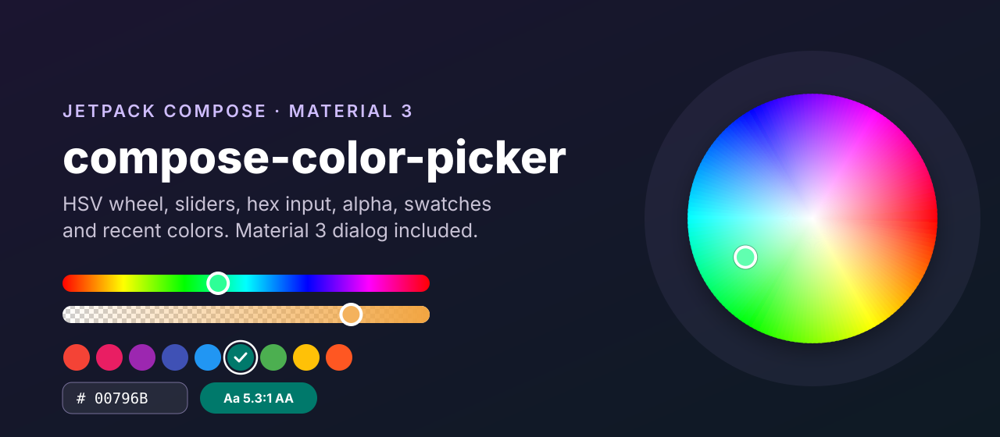
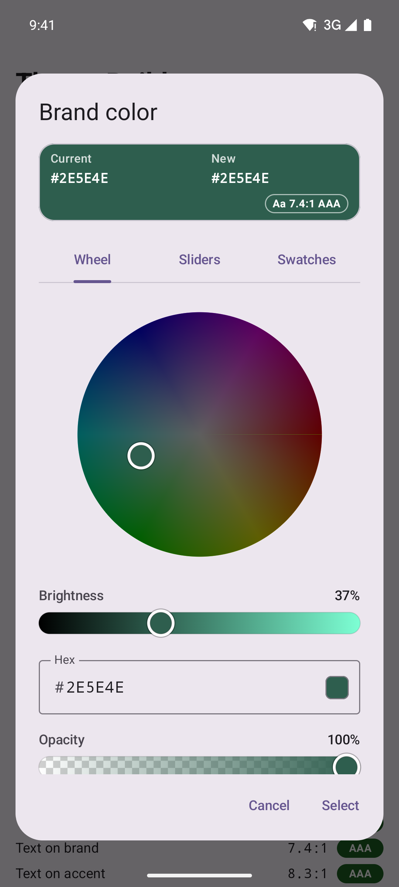
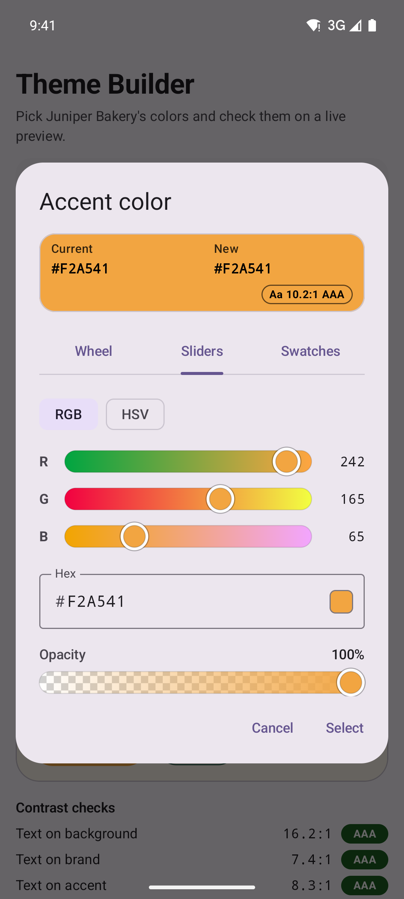
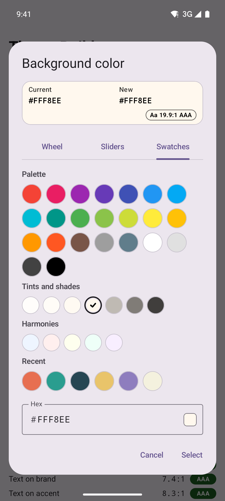
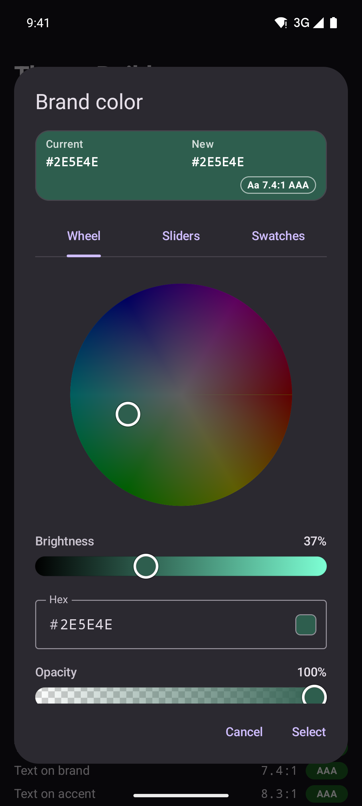
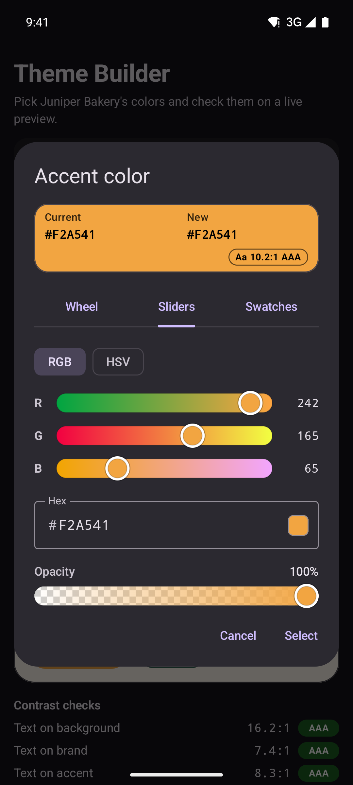
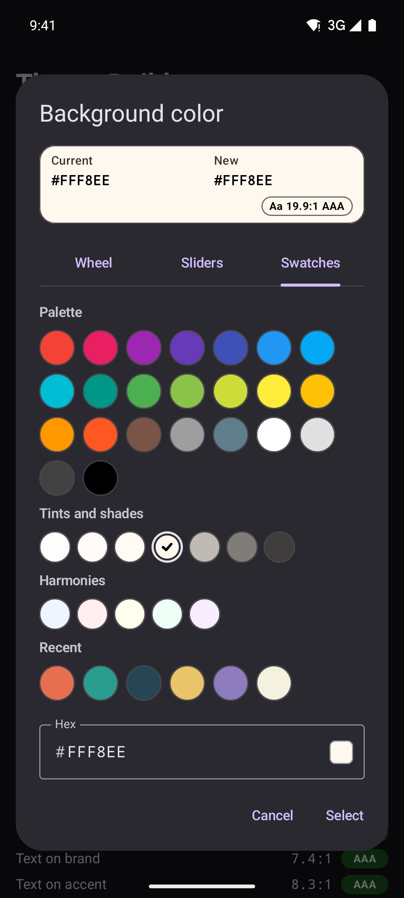
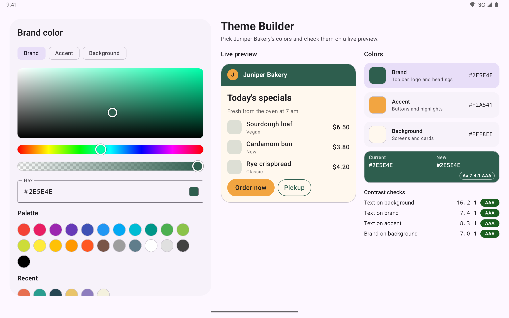
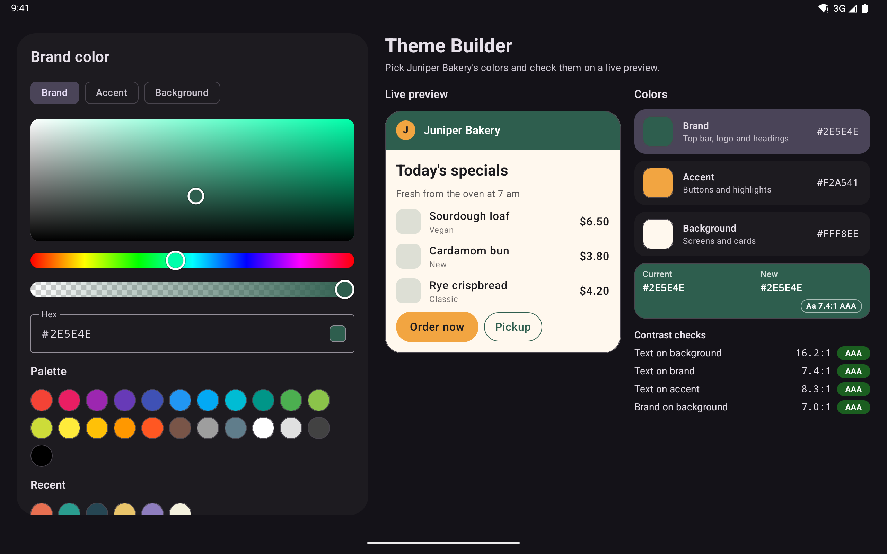

<p align="center">
  
</p>

<p align="center">
  <a href="https://github.com/halilozel1903/compose-color-picker/actions/workflows/ci.yml"></a>
  <a href="https://jitpack.io/#halilozel1903/compose-color-picker"></a>
  
  
  
  
  <a href="LICENSE"></a>
</p>

**compose-color-picker** is a complete color picker for Jetpack Compose. Drop in `ColorPickerDialog` for a Material 3 dialog with Wheel, Sliders and Swatches tabs, or build your own picker from the pieces: an HSV color wheel, a saturation/value panel, hue, alpha and RGB/HSV channel sliders, a validating hex field, swatch grids, a recent colors row and an old vs new preview with a WCAG contrast badge. The color math (conversions, hex parsing, contrast, wheel geometry, palettes) lives in a small pure Kotlin module with unit tests.

```kotlin
var brand by remember { mutableStateOf(Color(0xFF2E5E4E)) }
var showPicker by remember { mutableStateOf(false) }

Button(onClick = { showPicker = true }) { Text("Brand color") }

if (showPicker) {
    ColorPickerDialog(
        initialColor = brand,
        onDismissRequest = { showPicker = false },
        onColorSelected = { color ->
            brand = color
            showPicker = false
        },
    )
}
```

## Screenshots

Captured from the sample app (Theme Builder, a fictional app for picking a bakery's brand colors) on Android emulators by CI.

| Wheel | Sliders | Swatches and recent colors |
| :---: | :---: | :---: |
|  |  |  |
|  |  |  |

**Tablet:** the picker in a side pane (saturation/value panel, hue and opacity sliders, hex field, palette and recent colors) with the live theme preview and contrast checks next to it.





## Features

- **`ColorPickerDialog`**: a Material 3 dialog with the old and new color, **Wheel / Sliders / Swatches** tabs, a hex field, an opacity slider and Cancel / Select. Works on phones and tablets (up to 520 dp wide, scrolls when short).
- **`ColorPicker`**: the same picker without the dialog, for a bottom sheet, a side pane or a settings screen.
- **`HsvColorWheel`**: hue around the circle, saturation from the center, drawn with a sweep and a radial gradient on a `Canvas`. Tap or drag anywhere; drags outside the circle stick to the edge and the hue is kept at the center.
- **`SaturationValuePanel`**: the classic square for one hue; pair it with `HueSlider`.
- **Sliders**: `HueSlider`, `AlphaSlider` (over a checkerboard), `ColorSliders` (RGB or HSV channels with gradient tracks that preview where each channel leads) and `ColorChannelSlider` for your own tracks.
- **`HexColorField`**: `#RGB`, `#RRGGBB` and `#AARRGGBB`, sanitized as you type (pasting `#abc 123` works), with an error and a hint for invalid input. It follows the color when it changes elsewhere without fighting your typing.
- **Swatches**: `SwatchGrid` wraps to as many columns as fit, `ColorSwatch` marks the selection with a check mark that stays readable on any color, and `ColorSwatches.material` has the Material palette.
- **Recent colors**: `RecentColorsRow`, kept in `ColorPickerState` (most recent first, no duplicates, limited size) and saved across configuration changes and process death.
- **`ColorPreview`**: old vs new, each with its hex code, and a contrast badge (`Aa 7.4:1 AAA`) for white or black text on the new color.
- **Accessible**: sliders behave like Material sliders for TalkBack (content description, state description, range info and `setProgress`) and move with arrow keys; the wheel and panel announce hue, saturation and brightness and offer custom actions; swatches are selectable radio items.
- **Pure Kotlin core** (`compose-color-picker-core`): HSV/HSL/RGB conversions, hex parsing and formatting, WCAG contrast, wheel geometry, tints, shades and harmonies, recent colors. No Android dependency, unit tested.

## Installation

Add JitPack to `settings.gradle.kts`:

```kotlin
dependencyResolutionManagement {
    repositories {
        google()
        mavenCentral()
        maven("https://jitpack.io")
    }
}
```

Then the dependency:

```kotlin
dependencies {
    implementation("com.github.halilozel1903.compose-color-picker:compose-color-picker:1.0.0")
    // Pure Kotlin color math only (for JVM/KMP modules, tests or a server):
    // implementation("com.github.halilozel1903.compose-color-picker:compose-color-picker-core:1.0.0")
}
```

> The build is also set up for Maven Central (`io.github.halilozel1903:compose-color-picker`) via the vanniktech publish plugin.

## Usage

**The dialog**

```kotlin
// Keep the state outside the dialog to remember recent colors between openings.
val pickerState = rememberColorPickerState(initialColor = accent, recentColors = savedRecents)

ColorPickerDialog(
    initialColor = accent,
    state = pickerState,
    title = "Accent color",
    initialTab = ColorPickerTab.Swatches,   // Wheel, Sliders or Swatches
    tabs = listOf(ColorPickerTab.Wheel, ColorPickerTab.Swatches),
    showAlpha = false,                        // hides the opacity slider, hex field takes RGB only
    swatches = ColorSwatches.material,
    onDismissRequest = { showPicker = false },
    onColorSelected = { color ->
        accent = color
        savedRecents = pickerState.recentColors   // Select adds the color to the recent list
        showPicker = false
    },
)
```

**Inline picker**

```kotlin
val state = rememberColorPickerState(Color(0xFF6750A4))

ColorPicker(
    state = state,
    modifier = Modifier.verticalScroll(rememberScrollState()).padding(24.dp),
)

Button(onClick = { onSave(state.color) }) { Text("Save") }
```

**Build your own**

```kotlin
val state = rememberColorPickerState(Color(0xFFF2A541))

Column(verticalArrangement = Arrangement.spacedBy(16.dp)) {
    ColorPreview(oldColor = state.originalColor, newColor = state.color, onOldColorClick = state::reset)
    HsvColorWheel(state, Modifier.size(240.dp))
    // or: SaturationValuePanel(state, Modifier.fillMaxWidth().height(180.dp))
    HueSlider(state)
    AlphaSlider(state)
    ColorSliders(state, initialMode = ColorSliderMode.Hsv)
    HexColorField(color = state.color, onColorChange = { state.setColor(it) }, modifier = Modifier.fillMaxWidth())
    SwatchGrid(colors = ColorSwatches.material, onColorSelected = { state.setColor(it) }, selectedColor = state.color)
    RecentColorsRow(colors = state.recentColors, onColorSelected = { state.setColor(it) })
}
```

Every component also has a stateless form, for example `HsvColorWheel(hue, saturation, onHueSaturationChange = { h, s -> ... }, value = 0.9f)`, `HueSlider(hue, onHueChange)` and `AlphaSlider(alpha, onAlphaChange, color)`.

**State**

```kotlin
state.color                  // the picked Color (with alpha)
state.hue                    // 0 until 360, kept when saturation or brightness reach 0
state.saturation; state.value; state.alpha
state.setColor(Color.Red, keepAlpha = true)
state.updateHue(200f); state.updateSaturationValue(0.6f, 0.8f); state.updateAlpha(0.5f)
state.addToRecent()          // the dialog does this on Select
state.recentColors           // most recent first, at most maxRecentColors
state.reset()                // back to originalColor
```

**A custom channel slider**

```kotlin
ColorChannelSlider(
    value = warmth,
    onValueChange = { warmth = it },
    trackBrush = Brush.horizontalGradient(listOf(Color(0xFF8AB4F8), Color(0xFFFFB74D))),
    thumbColor = lerp(Color(0xFF8AB4F8), Color(0xFFFFB74D), warmth),
    contentDescription = "Warmth",
)
```

**Compose helpers**

```kotlin
Color(0xFF6750A4).toHex()            // "#6750A4"
parseHexColor("#80F2A541")           // Color with 50% alpha, or null when invalid
brand.bestOnColor()                  // Color.White or Color.Black, whichever reads better
Color.White.contrastRatioOn(brand)   // 1.0 to 21.0
brand.toHsv(); brand.toHsl()
```

## The core module

`compose-color-picker-core` has no Android or Compose dependency. Colors are ARGB `Int`s, the same packing as `Color.toArgb()`:

```kotlin
ColorMath.toHsv(0xFF6750A4.toInt())                 // Hsv(hue=256.4, saturation=0.51, value=0.64, alpha=1.0)
ColorMath.hslToArgb(200f, 0.6f, 0.5f)
Rgb.fromArgb(argb).red

HexColor.parse("#F2A541")                           // 0xFFF2A541
HexColor.parse("#80F2A541")                         // alpha first, like Android
HexColor.validate("#12345")                         // HexValidation.InvalidLength
HexColor.format(argb, includeAlpha = true)          // "#FFF2A541"

ColorContrast.contrastRatio(ColorContrast.WHITE, argb)   // 1.0 to 21.0
ColorContrast.level(4.6)                                 // WcagLevel.AA
ColorContrast.bestOnColor(argb)                          // WHITE or BLACK

WheelGeometry.hueSaturationAt(x, y, centerX, centerY, radius)   // clamped to the edge
WheelGeometry.positionOf(hue, saturation, centerX, centerY, radius)

Palettes.tintsAndShades(argb, count = 4)
Palettes.complementary(argb); Palettes.analogous(argb); Palettes.triadic(argb)

RecentColors(maxSize = 8).add(red).add(blue).add(red).colors   // [red, blue]
```

| API | What it does |
| --- | --- |
| `ColorMath`, `Hsv`, `Hsl`, `Rgb` | Channel packing, RGB/HSV/HSL conversions, mixing and compositing |
| `HexColor`, `HexValidation` | Parse, validate, sanitize and format `#RGB`, `#RRGGBB`, `#AARRGGBB` |
| `ColorContrast`, `WcagLevel` | Relative luminance, contrast ratio, WCAG level, best on-color |
| `WheelGeometry` | Point to hue/saturation and back on a wheel, with clamping |
| `Palettes`, `MaterialPalette` | Tints, shades, complementary, analogous, triadic, split complementary, tetradic; Material 500 swatches |
| `RecentColors` | Immutable recent list: most recent first, no duplicates, max size |

## Sample app

The `sample` module is Theme Builder, a fictional app for picking Juniper Bakery's brand, accent and background colors. Phones list the three colors and open `ColorPickerDialog` to edit one; wide windows show the picker in a side pane and update the live preview and the contrast checks as you drag.

Taps can't be timed reliably through adb, so the sample opens a screen from an intent extra (used by `scripts/screenshots.sh`):

```bash
./gradlew :sample:installDebug
adb shell am start -n io.github.halilozel1903.colorpicker.sample/.MainActivity --es scene wheel
```

`scene` is one of `wheel` (the brand color dialog on the Wheel tab), `sliders` (the accent color on the Sliders tab), `swatches` (the background color on the Swatches tab) or `tablet` (the two pane builder). CI captures the first three on a Pixel 7 and `tablet` on a Pixel Tablet emulator in landscape, in light and dark mode, checks each capture for the screen's text and fails on blank images.

## Project structure

| Module | What it is |
| --- | --- |
| `colorpicker-core` | Pure Kotlin: conversions, hex, contrast, wheel geometry, palettes, recent colors. Published as `compose-color-picker-core` |
| `colorpicker` | Compose: `ColorPickerDialog`, `ColorPicker`, `rememberColorPickerState`, wheel, panel, sliders, hex field, swatches, preview. Published as `compose-color-picker` |
| `sample` | Theme Builder, a phone and tablet app with screenshot scenes |

## Tech stack

Kotlin 2.4 · AGP 9.4 with built-in Kotlin · Gradle 9.6 · Jetpack Compose (BOM 2026.09) · Material 3 · Compose `Canvas`, gradients and pointer input · GitHub Actions with Android emulators

## License

MIT. See [LICENSE](LICENSE).
